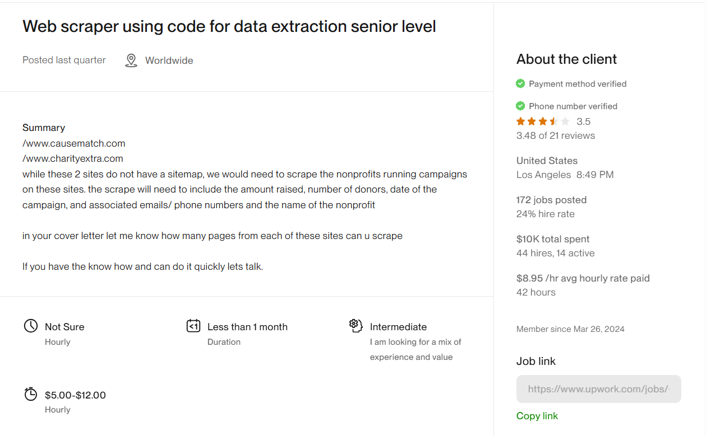
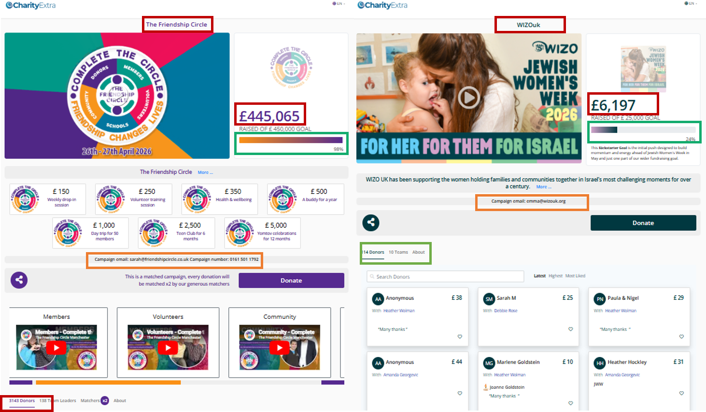
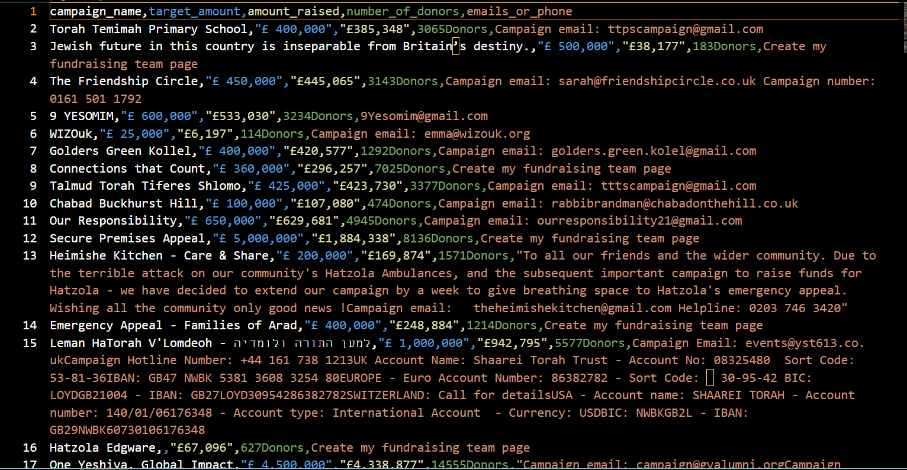
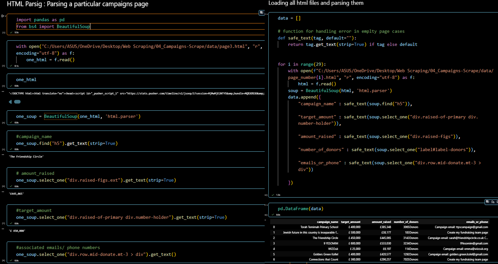
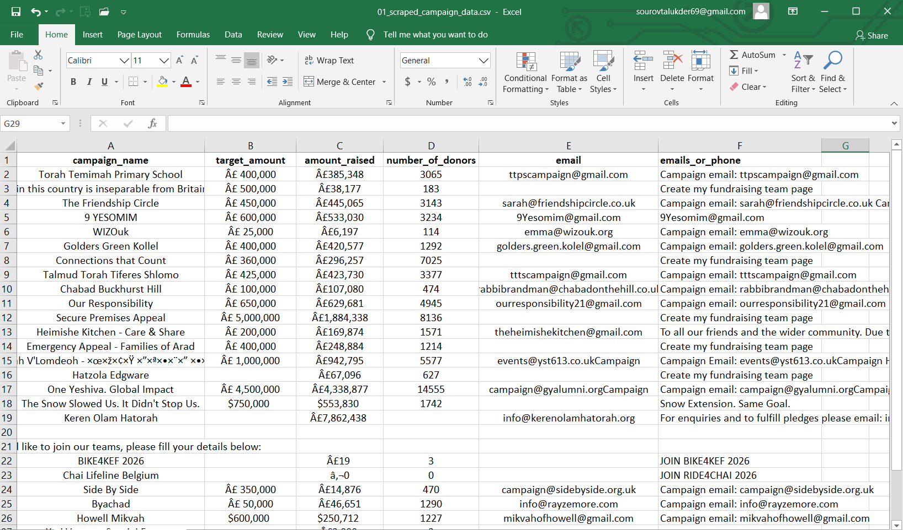

# Data Extraction : Scraping Running campaigns Listings

Successfully completed a Data Extraction Project

The Project task was to scrape Running campaigns data from a **Fund-Raising & Donation** Website . `Website Link` : <a href="https://www.charityextra.com/home/campaigns/crowdfunders">Click Here</a>. 

## I was asked to collect `Data` like : 
- campaign_name
- target_amount
- amount_raised
- number_of_donors
- emails_or_phone

---
The website was Highly Interactive and heavely JabaScript rendered. To collect `Data` from this website i used

- **Python** : Core language
- **Playwright** : Browser automation
- **Beautiful Soup** : HTML parsing
- **Pandas** : Data cleaning & Transformation
- **Excel / CSV** : Saving data in an accessible format

## I used two approach in this project

> Without downloading HTML, directly extracting data while browser automation `Playwright` runs and then saving it into CSV.

> Downloading each HTML page, then extracting data from each HTML file using Beautiful Soup (Jupyter Notebook), and then saving it into CSV.

## **Project Source**  
I got this project from Upwork. 

  

---

## **Data Source**  
The data was available on the website in the following format:  

  

  

---

## **Scraped Data**
After directly scraping, data was look like

  

---

## **HTML Parsing & Data Cleaning**
After dowloading html, applied data transformation & cleaning

  

---

## **Final Output**  
Deliverable: clean csv data  

  

---

## **Thanks for Exploring My Project☺️**

**Success never has any shortcuts**  
**Hard work and consistency are the keys**  
**Passion and love for work leads to success ✔️**

